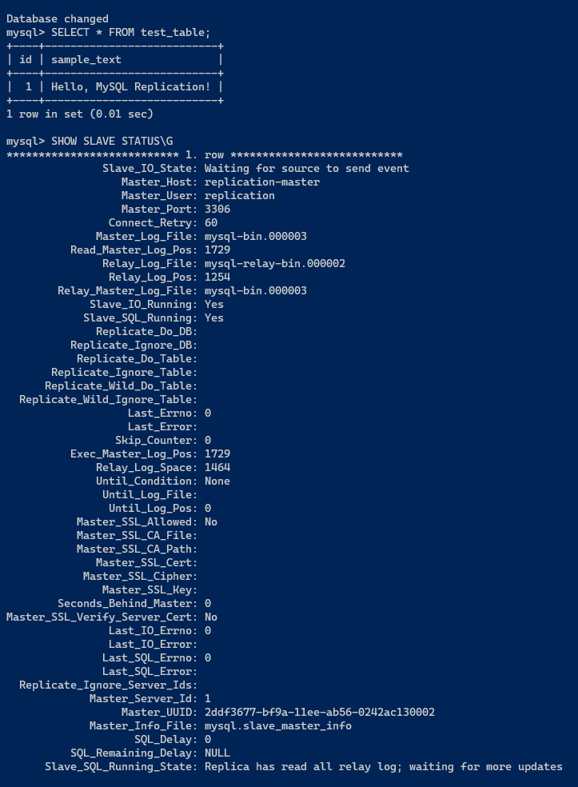

# Домашнее задание к занятию "`12-06hw`" - `Ливчак Сергей`

### Задание 1

`Выполните конфигурацию master-slave репликации, примером можно пользоваться из лекции.`

`Взята машина из прошлых лекций с Docker.`

1. `Файл конфигурации docker compose и конфигурационные файлы mysql которые мы пробрасываем в контейнеры так как в контейнерах нет текстовых редакторов`
**docker compose** 


2. `смотрим master status, создаём таблицу, смотрим master status`
**Манипуляции с master** 


3. `проверяем работу что данные реплицировались и смотрим slave status`
**Манипуляции с slave** 



mms.yml
```
version: '3'

services:
  replication-master:
    image: mysql:8.0
    environment:
      MYSQL_ALLOW_EMPTY_PASSWORD: 'true'
    volumes:
      - ./master.cnf:/etc/mysql/conf.d/master.cnf
      - ./path/to/world/dump:/docker-entrypoint-initdb.d
    networks:
      - replication

  replication-slave:
    image: mysql:8.0
    environment:
      MYSQL_ALLOW_EMPTY_PASSWORD: 'true'
    volumes:
      - ./slave.cnf:/etc/mysql/conf.d/slave.cnf
    networks:
      - replication

networks:
  replication:
    driver: bridge
```

`При необходимости прикрепитe сюда скриншоты
`


---

### Задание 2

`Разработайте план для выполнения горизонтального и вертикального шаринга базы данных. База данных состоит из трёх таблиц:

пользователи,
книги,
магазины (столбцы произвольно).
Опишите принципы построения системы и их разграничение или разбивку между базами данных.

Пришлите блоксхему, где и что будет располагаться. Опишите, в каких режимах будут работать сервера.`

Добавим немного данных для полноты картины.
У нас есть 3 таблицы `customers` `books` `warehouse_store`
Таблица `customers` состоит из `id_user`, `id_book`, `username`, `password`.
Таблица `books` состоит из `id_book`, `name`, `author`, `year`.
Таблица `warehouse_store` состоит из `id_shop`,`id_book`, `quantity`.

Сервера которыми мы распологаем -
   1) Центральный сервер в офисе
   2) Сервер в магазинах


### Горизонтальный шардинг

Горизонтальный шардинг подразумевает разделение таблиц на строки между серверами.

Таблицу `customers` можно горизонтально шардировать по серверам магазинов основываясь на географическом положении активности пользователя - `id_user`.
Таблице `books` горизонтальный шардинг не требуется, таблица может целиком храниться на центральном сервере, для обеспечения единого управления каталогом книг.
Таблица `warehouse_store`можно горизонтально шардировать по `id_shop`чтобы каждый сервер магазина содержал информацию только о наличии книг в конкретном магазине.


### Вертикальный шардинг

Вертикальный шардинг подразумевает разделение таблиц на столбцы между серверами. 
Таблица `customers` 
   Центральный сервер: таблица целиком (Для обеспеченея веб досупа к данным)
   Серверы в магазинах: `id_user`, `id_book`, `username` (для локального учёта активностей пользователей, без колонки `password` для обеспечения безопастности).
Таблице `books` целиком будет храниться на центральном сервере для обеспечения единого управления каталогом книг, магазинам нет необходимости в дополнительной информации о книге.
Таблица `warehouse_store` Целиком хранится на серверах магазинов. (для учёта наличия книг непосредственно в магазинах).

### Режимы работы серверов

Центральный Сервер работает в режиме Master, обрабатывая обновления каталога книг и управляя централизованной информацией о пользователях.
Сервера в магазинах работают в режиме slave, реплицируя информацию о книгах с центрального сервера и обновляя локальные данные о наличии книг и активности пользователей. 
В случае отказа связи с центральным сервером, могут временно переходить в режим master для обеспечения непрерывности локальных операций, но с ограниченными возможностями (например, без возможности обновления каталога книг).

---
[Диаграмма шардинга БД Bookinist.drawio](./bookinist.drawio)


